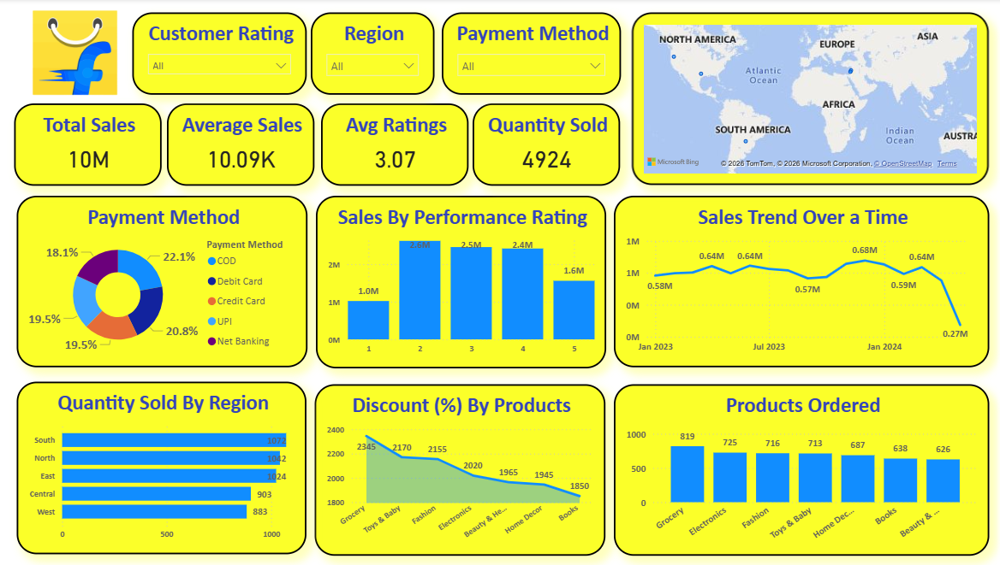

# 📊 Sales Analytics Dashboard (Power BI)

## 📌 Project Overview
This project is an **interactive Sales Analytics Dashboard** built using **Microsoft Power BI**. The dashboard provides a comprehensive view of sales performance across multiple dimensions such as **region, customer ratings, payment methods, products, time trends, and discounts**.

It is designed to help businesses and analysts:
- Monitor sales performance
- Understand customer behavior
- Track regional demand
- Analyze payment preferences
- Evaluate product performance
- Identify trends and patterns over time

---

## 🎯 Key Objectives
- Provide real-time business insights
- Enable data-driven decision making
- Visualize complex sales data in a simple format
- Improve performance monitoring
- Support strategic planning

---

## 🧩 Dashboard Features

### 🔍 Filters / Slicers
- **Customer Rating** (1–5)
- **Region** (North, South, East, West, Central)
- **Payment Method** (COD, Debit Card, Credit Card, UPI, Net Banking)

These slicers dynamically update all visuals.

---

## 📈 KPIs (Top Metrics)
- **Total Sales:** 10M
- **Average Sales:** 10.09K
- **Average Rating:** 3.07
- **Quantity Sold:** 4924

---

## 📊 Visualizations

### 🗺️ Sales by Region (Map View)
- Geographic distribution of sales across the world

### 💳 Payment Method Distribution (Donut Chart)
- COD
- Debit Card
- Credit Card
- UPI
- Net Banking

### ⭐ Sales by Performance Rating (Bar Chart)
- Rating-wise sales performance (1–5)

### 📉 Sales Trend Over Time (Line Chart)
- Monthly sales trend analysis

### 🌍 Quantity Sold by Region (Horizontal Bar Chart)
- Region-wise quantity distribution

### 💸 Discount (%) by Products (Area/Line Chart)
- Product-wise discount comparison

### 📦 Products Ordered (Bar Chart)
- Most ordered product categories

---

## 🧱 Data Model Structure (Logical)
Typical fields used:
- Order ID
- Customer ID
- Product Category
- Quantity
- Sales Amount
- Discount
- Region
- Rating
- Payment Method
- Order Date

---

## 🛠️ Tools & Technologies
- **Microsoft Power BI Desktop**
- **Power Query** (Data Cleaning & Transformation)
- **DAX** (Measures & Calculations)
- **Excel / CSV** (Data Source)

---

## 🧮 Example DAX Measures
```DAX
Total Sales = SUM(Sales[SalesAmount])

Average Sales = AVERAGE(Sales[SalesAmount])

Avg Ratings = AVERAGE(Sales[Rating])

Quantity Sold = SUM(Sales[Quantity])
```

---

## 🚀 Use Cases
- Business performance analysis
- Sales forecasting
- Regional market analysis
- Product demand tracking
- Customer behavior analysis
- Marketing strategy planning

---

## 📂 Repository Structure (Suggested)
```
Sales-Dashboard/
│
├── Data/
│   └── sales_data.csv
│
├── PowerBI/
│   └── sales_dashboard.pbix
│
├── Images/
│   └── dashboard_preview.png
│
└── README.md
```

---

## 🧠 Insights Enabled
- Best performing regions
- Most preferred payment methods
- High-demand products
- Low/high discount categories
- Seasonal sales patterns
- Rating impact on sales

---

## 📌 Future Enhancements
- Predictive sales forecasting (ML integration)
- Customer segmentation
- Profit analysis
- Inventory tracking
- Automated refresh with cloud data sources
- Power BI Service publishing

---

## 📜 License
This project is open for learning, academic use, and portfolio demonstration.

---

## 👤 Author
**Aravind M**  
Power BI Developer | Data Analyst | Data Science Enthusiast

---

⭐ If you find this project useful, feel free to star the repository and share it!

